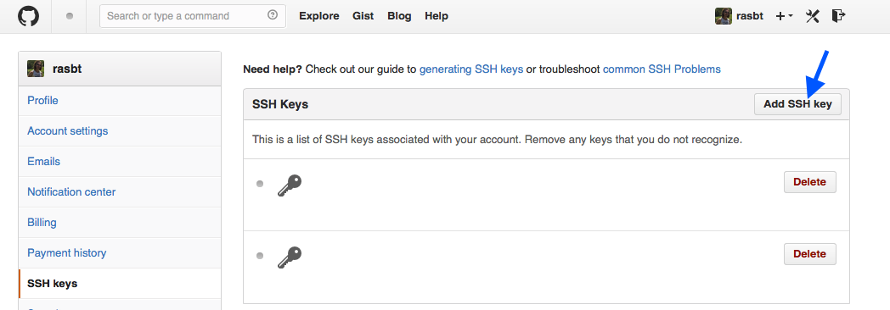
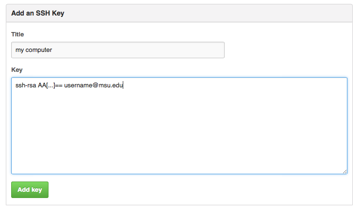

Sebastian Raschka  
last updated: 06/01/2014

#Table of Contents

- [generate a private/public key pair](#generate-a-privatepublic-key-pair)
- [Add SSH keys to GitLab/GitHub SSH keys](#add-ssh-keys-to-gitlabgithub-ssh-keys)
- [Add the content below to ~/.ssh/config](#add-the-content-below-to-sshconfig)
- [Create a new repository on GitHub/GitLab](#create-a-new-repository-on-githubgitlab)

#Connecting to GitHub and GitLab servers via SSH

 
 

## generate a private/public key pair
[[back to top](#table-of-contents)]

The private/public key pairs are usually stored in the user's home directory under the (invisible) directory `.ssh/`.

The default file names where the private/public key pairs are stored are

	- id_rsa
	
	- id_rsa.pub

**Procedure:**

<pre>
[bash]~ >cd ~/.ssh
[bash]~/.ssh > ssh-keygen -t rsa -C "username@uni.edu"
Generating public/private rsa key pair.
Enter file in which to save the key (/home/username/.ssh/id_rsa): 
/home/username/.ssh/id_rsa already exists.
Overwrite (y/n)? y
Enter passphrase (empty for no passphrase): 
Enter same passphrase again: 
Your identification has been saved in /home/username/.ssh/id_rsa.
Your public key has been saved in /home/username/.ssh/id_rsa.pub.
The key fingerprint is:
11:8[...]:f1:a5 username@uni.edu
The key's randomart image is:
+--[ RSA 2048]----+
| o+. =+.=%|
[ ...] 
+-----------------+ 
[bash]~/.ssh >ssh-add id_rsa
Enter passphrase for id_rsa: 
Identity added: id_rsa (id_rsa)

</pre>

 
 

##Add SSH keys to GitLab/GitHub SSH keys
[[back to top](#table-of-contents)]

Copy the content from `id_rsa.pub` and add them to the SSH keys on GitHub/GitLab.
	
e.g., 

	ssh-rsa AA[...]== username@uni.edu	
	
 
	

 
	
	

 
 

## Add the content below to ~/.ssh/config
[[back to top](#table-of-contents)]

Replace the example information in the following lines and add them to the `.ssh/config` file:

<pre>
Host GitLab.uni.edu
HostName GitLab.uni.edu
IdentityFile ~/.ssh/id_rsa
User username
</pre>

 
 

## Create a new repository on GitHub/GitLab
[[back to top](#table-of-contents)]

Create new repository on GitHub/GitLab:

 

 

then change the global Git settings:

	[bash]~/Gits >bash]~/ > git config --global user.name "rasbt"
	[bash]~/Gits >bash]~/ > git config --global user.email "username@uni.edu"

Now, you can clone the new repository to your local drive:

	[bash]~/ >cd github_repos
	[bash]~/github_repos/ >git clone git@github.com:rasbt/github_reference.git
